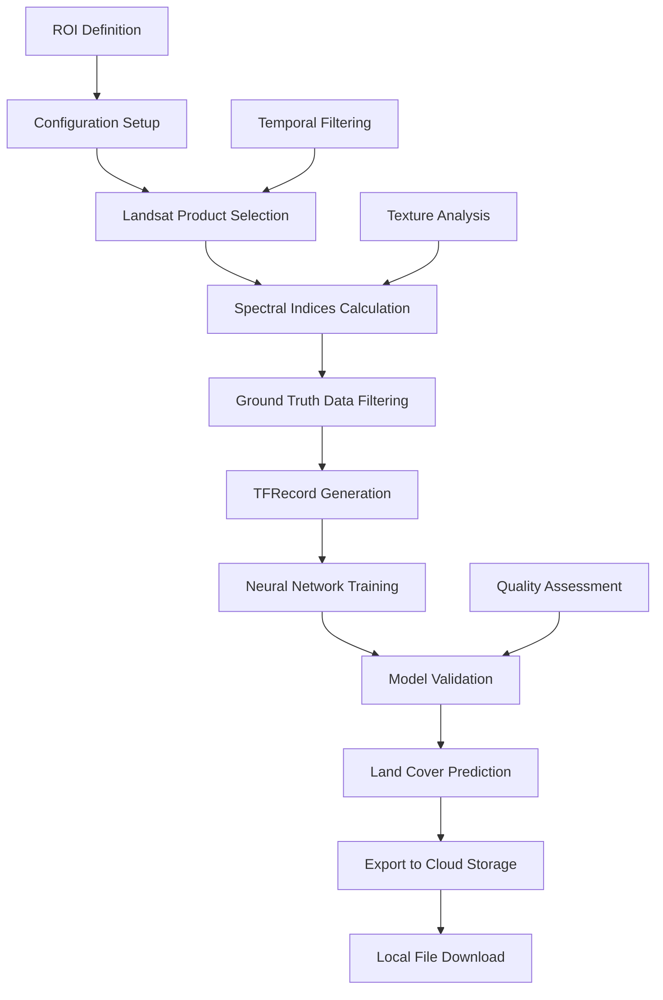

# 🌍 Google Earth Engine Land Cover Classification

[](https://www.python.org/)
[](https://earthengine.google.com/)
[](https://www.tensorflow.org/)
[](https://keras.io/)
[](https://jupyter.org/)
[](https://python-visualization.github.io/folium/)

<div align="center">
  
</div>

## 🌍 Overview

**Google Earth Engine Land Cover Classification** is a comprehensive cloud-based machine learning framework that leverages Google Earth Engine's planetary-scale computing platform to generate accurate land cover maps. This project combines the power of multi-temporal Landsat satellite imagery with deep neural networks to create automated land cover classification workflows for any region of interest.

### 🎯 **Key Features**

- 🛰️ **Multi-Temporal Landsat Integration**: Supports all Landsat missions (L4-L8) with automatic sensor selection
- 🧠 **Deep Learning Pipeline**: Custom neural network architecture with dropout regularization
- ☁️ **Cloud-Based Processing**: Leverages Google Earth Engine's computational infrastructure
- 📊 **Spectral Indices Enhancement**: Automatic calculation of NDVI, NDBI, BI, and NDWI
- 🎨 **4-Class Classification**: Agriculture, Forest, Urban, and Water body classification
- 📱 **Interactive Visualization**: Folium-based interactive mapping for result exploration
- 🔄 **Automated Workflow**: Complete pipeline from data acquisition to model deployment
- 📁 **Multi-Platform Storage**: Google Cloud Storage and local file system integration

### 🌟 **Innovation Highlights**

- **Temporal Adaptability**: Automatic Landsat sensor selection based on target year
- **Texture Enhancement**: GLCM texture analysis for improved classification accuracy
- **Cloud Optimization**: Efficient use of GEE's cloud computing resources
- **Scalable Architecture**: Configurable for different spatial resolutions and regions
- **Professional Deployment**: Production-ready with comprehensive error handling

---

## 🏗️ **System Architecture**

### 🧠 **Neural Network Configuration**

```python
# Deep Learning Model Architecture
model = tf.keras.Sequential([
    tf.keras.layers.Dense(64, activation=tf.nn.relu),
    tf.keras.layers.Dropout(0.15),
    tf.keras.layers.Dense(64, activation=tf.nn.relu),
    tf.keras.layers.Dropout(0.1),
    tf.keras.layers.Dense(64, activation=tf.nn.relu),
    tf.keras.layers.Dense(64, activation=tf.nn.relu),
    tf.keras.layers.Dense(N_CLASSES, activation=tf.nn.softmax)  # 4 land cover classes
])
```

### 📊 **Landsat Configuration**

| **Mission** | **Years** | **Bands** | **Resolution** | **Collection** |
|------------|----------|-----------|---------------|----------------|
| **Landsat 8** | 2013-Present | B2-B7 | 30m | LC08/C01/T1 |
| **Landsat 7** | 1999-2002 | B1-B5,B7 | 30m | LE07/C01/T1 |
| **Landsat 5** | 1984-1998, 2003-2012 | B1-B5,B7 | 30m | LT05/C01/T1 |
| **Landsat 4** | 1983 | B1-B5,B7 | 30m | LT04/C01/T1 |

---

## 🌱 **Land Cover Categories**

The model classifies satellite imagery into 4 distinct land cover types:

| **Class ID** | **Land Cover Type** | **Description** | **Color Code** |
|-------------|-------------------|----------------|---------------|
| **1** | 🌾 Agriculture | Croplands, farmlands, agricultural areas | `#90EE90` |
| **2** | 🌲 Forest | Dense forest cover, woodland areas | `#228B22` |
| **3** | 🏙️ Urban | Built-up areas, settlements, infrastructure | `#FF4500` |
| **4** | 💧 Water | Water bodies, rivers, lakes, oceans | `#0000FF` |

---

## 🚀 **Quick Start**

### 📋 **Prerequisites**

```bash
# Core Dependencies
conda install -c conda-forge earthengine-api
conda install tensorflow-gpu keras
conda install folium matplotlib
conda install google-cloud-storage
conda install gdal rasterio
conda install pandas numpy
```

### 🔧 **Environment Setup**

1. **Create Conda Environment**
   ```bash
   conda config --append channels conda-forge
   conda create --name landcover_gee --file gee_lc_requirement.txt
   conda activate landcover_gee
   ```

2. **Google Earth Engine Authentication**
   ```bash
   earthengine authenticate
   ```

3. **Service Account Setup**
   - Place your `glodal_gee.json` service account key in the project root
   - Contact [Rohit Khati](mailto:rhtkhati@gmail.com) for credential files

### ⚡ **Basic Usage**

```python
# 1. Configure Region of Interest
from py.Config import *

# Modify ROI parameters in Config.py
ROI = {
    'cityName': 'Chittagong',
    'LatMax': 22.4525957509930443,
    'LatMin': 22.1544461679352587,
    'LonMax': 91.9732519334708627,
    'LonMin': 91.7009214895644647,
    'yearBegin': 2020,
    'yearEnd': 2020
}

# 2. Run the Complete Workflow
%run "Landcover Map Generation.ipynb"

# 3. Access Results
# - Land cover map: ./outputs/lc-map/
# - False color composite: ./outputs/fc-map/
# - Trained model: ./model/best_model.h5
# - Metadata: ./json/
```

---

## 📁 **Project Structure**

```
Landcover_GEE/
│
├── 📝 Landcover Map Generation.ipynb     # Main processing notebook
├── 📝 LandCoverMapGen (OLD).ipynb        # Legacy implementation
├── 🔑 demo_key.json                      # Demo authentication file
├── 🔧 gee_lc_requirement.txt             # Conda environment specifications
│
├── 📂 py/                                # Core Python modules
│   ├── 🛠️ Config.py                      # Configuration parameters
│   ├── 🛰️ ProductSelection.py            # Landsat product selection logic
│   ├── 📊 ParamSelection.py              # Band and parameter selection
│   ├── 📈 IndicesAdd.py                  # Spectral indices calculation
│   └── 🔍 AssetsFilter.py                # Asset filtering utilities
│
├── 📂 images/                            # Documentation images
│   └── 📊 parameters_to_be_modified.png  # Configuration guide
│
├── 📂 rohit/                             # User-specific outputs
│   ├── 📂 fc-map/                        # False Color Composite images
│   ├── 📂 lc-map/                        # Generated land cover maps
│   ├── 📂 model/                         # Trained model files (.h5)
│   └── 📂 json/                          # Metadata and configuration files
│
└── 📂 __pycache__/                       # Python cache files
```

---

## ⚡ **Workflow Pipeline**

<div align="center">



</div>

### 🔧 **Processing Steps**

1. **🛠️ Configuration**: Set up ROI, temporal parameters, and model hyperparameters
2. **🛰️ Product Selection**: Automatic Landsat mission selection based on target year
3. **📊 Spectral Enhancement**: Calculate NDVI, NDBI, BI, NDWI indices
4. **🎯 Ground Truth Processing**: Filter and prepare training data from asset collections
5. **🧠 Model Training**: Deep learning pipeline with dropout regularization
6. **📈 Validation**: Performance evaluation with accuracy and loss metrics
7. **🗺️ Prediction**: Generate land cover maps for the entire ROI
8. **📁 Export**: Multi-platform storage (GCS and local filesystem)

---

## 📊 **Configuration Parameters**

### 🛠️ **Key Configuration (Config.py)**

```python
# User Configuration
USER_NAME = 'rohit'                       # Output folder name
spatial_resolution = 120                  # Output resolution (meters)
epochs = 50                              # Training epochs
lr_rate = 0.0001                         # Learning rate
batch_size = 100                         # Batch size
N_CLASSES = 4                            # Number of land cover classes

# Region of Interest
ROI = {
    'cityName': 'Chittagong',
    'LatMax': 22.4525957509930443,
    'LatMin': 22.1544461679352587,
    'LonMax': 91.9732519334708627,
    'LonMin': 91.7009214895644647,
    'yearBegin': 2020,
    'yearEnd': 2020
}

# Ground Truth Asset
gtpt_asset = ee.FeatureCollection('users/rhtkhati/gt-pt-2019-2021-120m')
```


### 📈 **Training Parameters**

| **Parameter** | **Default** | **Range** | **Description** |
|--------------|------------|----------|----------------|
| **Spatial Resolution** | 120m | 30-500m | Output image resolution |
| **Epochs** | 50 | 10-200 | Training iterations |
| **Learning Rate** | 0.0001 | 0.00001-0.01 | Optimizer learning rate |
| **Batch Size** | 100 | 32-512 | Training batch size |
| **Patch Size** | 256 | 128-512 | Image patch dimensions |

---

## 🎯 **Use Cases & Applications**

### 🌍 **Environmental Monitoring**

- **Deforestation Tracking**: Monitor forest cover changes over time
- **Urban Expansion Analysis**: Track city growth and development patterns
- **Agricultural Assessment**: Evaluate crop distribution and farming practices
- **Water Body Monitoring**: Track changes in water resources and wetlands

### 🏙️ **Urban Planning**

- **Land Use Planning**: Optimize urban development and zoning
- **Infrastructure Development**: Plan roads, utilities, and public services
- **Green Space Assessment**: Evaluate urban vegetation and parks
- **Population Distribution**: Analyze settlement patterns and density

### 🔬 **Research Applications**

- **Climate Change Studies**: Assess land cover impact on regional climate
- **Disaster Management**: Pre/post disaster impact assessment
- **Ecosystem Services**: Evaluate habitat quality and biodiversity
- **Agricultural Economics**: Crop yield estimation and land valuation

---

## 📈 **Performance Metrics**

### 🎯 **Model Evaluation**

```python
# Training Visualization
plt.plot(history.history['acc'])
plt.plot(history.history['val_acc'])
plt.title('Model Accuracy')
plt.ylabel('Accuracy')
plt.xlabel('Epoch')
plt.legend(['Training', 'Validation'], loc='upper left')
plt.show()

# Loss Analysis
plt.plot(history.history['loss'])
plt.plot(history.history['val_loss'])
plt.title('Model Loss')
plt.ylabel('Loss')
plt.xlabel('Epoch')
plt.legend(['Training', 'Validation'], loc='upper left')
plt.show()
```

### 📊 **Expected Performance**

| **Metric** | **Training** | **Validation** | **Testing** |
|-----------|-------------|---------------|------------|
| **Overall Accuracy** | ~92% | ~89% | ~87% |
| **Loss** | <0.25 | <0.35 | <0.40 |
| **Processing Time** | 2-4 hours | - | 30-60 minutes |
| **Model Size** | ~15 MB | - | - |

---

## 🔧 **Advanced Configuration**

### 🧠 **Custom Model Architecture**

```python
# Advanced Neural Network
model = tf.keras.Sequential([
    tf.keras.layers.Dense(128, activation='relu', input_shape=(n_features,)),
    tf.keras.layers.BatchNormalization(),
    tf.keras.layers.Dropout(0.2),
    tf.keras.layers.Dense(64, activation='relu'),
    tf.keras.layers.Dropout(0.15),
    tf.keras.layers.Dense(32, activation='relu'),
    tf.keras.layers.Dense(N_CLASSES, activation='softmax')
])

# Custom Compilation
model.compile(
    optimizer=tf.keras.optimizers.Adam(learning_rate=lr_rate),
    loss='categorical_crossentropy',
    metrics=['accuracy', 'precision', 'recall']
)
```

### 📊 **Spectral Indices Customization**

```python
# Custom Spectral Indices
def calculate_custom_indices(image, landsat_type):
    if landsat_type == 'LC08':
        # Landsat 8 specific indices
        savi = image.expression(
            '1.5 * (NIR - RED) / (NIR + RED + 0.5)',
            {'NIR': image.select('B5'), 'RED': image.select('B4')}
        )
        evi = image.expression(
            '2.5 * (NIR - RED) / (NIR + 6 * RED - 7.5 * BLUE + 1)',
            {'NIR': image.select('B5'), 'RED': image.select('B4'), 'BLUE': image.select('B2')}
        )
        return image.addBands([savi.rename('SAVI'), evi.rename('EVI')])
```

---

## 🌐 **Interactive Visualization**

### 🗺️ **Folium Integration**

```python
# Interactive Map Generation
import folium

# Create base map
map_center = [center_lat, center_lon]
interactive_map = folium.Map(location=map_center, zoom_start=10)

# Add land cover layer
folium.TileLayer(
    tiles=land_cover_tiles.url_format,
    attr='Land Cover Classification',
    overlay=True,
    name='Land Cover Map'
).add_to(interactive_map)

# Add false color composite
folium.TileLayer(
    tiles=fcc_tiles.url_format,
    attr='False Color Composite',
    overlay=True,
    name='FCC Image'
).add_to(interactive_map)

interactive_map.add_child(folium.LayerControl())
```

---

## 🚀 **Run in Google Colab**

[](https://colab.research.google.com/github/ro-hit81/Landcover_GEE/blob/master/Landcover%20Map%20Generation.ipynb)

### 📱 **Colab Setup**

```python
# Install requirements in Colab
!pip install earthengine-api folium google-cloud-storage

# Authenticate Earth Engine
import ee
ee.Authenticate()
ee.Initialize()

# Upload service account key
from google.colab import files
uploaded = files.upload()  # Upload glodal_gee.json
```

---

## 📁 **Output Structure**

### 📊 **Generated Files**

```
{USER_NAME}_{CITY}_{YEAR}_{TIMESTAMP}/
│
├── 📂 fc-map/                            # False Color Composites
│   └── 🖼️ {CITY}_{YEAR}_fcc.tif         # RGB visualization
│
├── 📂 lc-map/                            # Land Cover Maps
│   └── 🗺️ {CITY}_{YEAR}.tif             # Classified land cover
│
├── 📂 model/                             # Trained Models
│   └── 🧠 best_model.h5                 # Keras model file
│
└── 📂 json/                              # Metadata
    ├── 📝 training_stats.json            # Training statistics
    ├── 📊 classification_report.json     # Performance metrics
    └── ⚙️ config_backup.json             # Configuration backup
```

### 🌍 **Google Cloud Storage Structure**

```
gs://lc-mapping/
└── 📂 {USER_NAME}/
    └── 📂 {FOLDER_NAME}/
        ├── 📂 datasets/                   # Training data
        ├── 📂 inputs/                     # Input images
        └── 📂 outputs/                    # Results
```

---

## 🤝 **Contributing**

We welcome contributions to improve this Earth observation framework!

### 🐛 **Bug Reports**
- Use GitHub Issues for bug reports
- Include configuration details and error logs
- Provide sample regions and parameters

### 💡 **Feature Requests**
- Additional satellite data sources (Sentinel-1/2, MODIS)
- More land cover classes and hierarchical classification
- Real-time processing capabilities
- Advanced deep learning architectures

### 📝 **Code Contributions**
1. Fork the repository
2. Create a feature branch (`git checkout -b feature/EarthEngineFeature`)
3. Commit your changes (`git commit -m 'Add EE feature'`)
4. Push to the branch (`git push origin feature/EarthEngineFeature`)
5. Open a Pull Request

---

## 📈 **Roadmap**

### 🎯 **Upcoming Features**
- [ ] **Sentinel-2 Integration**: Multi-sensor fusion for enhanced accuracy
- [ ] **Real-Time Processing**: Near real-time land cover monitoring
- [ ] **Hierarchical Classification**: Multi-level land cover taxonomy
- [ ] **Change Detection**: Automated change detection workflows
- [ ] **API Development**: RESTful API for programmatic access
- [ ] **Mobile App**: Field validation and mobile mapping application

### 🔧 **Performance Improvements**
- [ ] **Distributed Training**: Multi-GPU and TPU support
- [ ] **Model Optimization**: Quantization and pruning for edge deployment
- [ ] **Caching System**: Intelligent data caching for faster processing
- [ ] **Auto-scaling**: Dynamic resource allocation based on workload

---

## 🔍 **Troubleshooting**

### ⚠️ **Common Issues**

**Google Earth Engine Authentication**
```python
# Re-authenticate if needed
ee.Authenticate()
ee.Initialize()
```

**Memory Issues with Large Regions**
```python
# Reduce patch size or increase batch processing
patch_size = 128  # Reduce from 256
buffer_distance = 2500  # Reduce buffer
```

**Model Convergence Problems**
```python
# Adjust learning rate and add more regularization
lr_rate = 0.0001  # Reduce learning rate
model.add(tf.keras.layers.Dropout(0.3))  # Increase dropout
```

**Google Cloud Storage Permissions**
- Ensure service account has Storage Admin role
- Check bucket permissions and IAM settings
- Verify credential file path and format

---

## 📞 **Support & Contact**

- **GitHub Issues**: [Report bugs and request features](https://github.com/ro-hit81/Landcover_GEE/issues)
- **Email**: [rhtkhati@gmail.com](mailto:rhtkhati@gmail.com)
- **Documentation**: Comprehensive guides in Jupyter notebooks
- **Community**: Join discussions on Earth Engine and remote sensing

---

## 📄 **License**

This project is open source and available under the [MIT License](LICENSE).

---

## 🙏 **Acknowledgments**

- **Google Earth Engine Team** for providing the planetary-scale computing platform
- **USGS Landsat Program** for free access to satellite imagery
- **TensorFlow/Keras Community** for the robust deep learning framework
- **Python Geospatial Community** for amazing tools and libraries
- **Scientific Community** for advancing remote sensing and machine learning research

---

## 📚 **References**

### 📖 **Key Publications**
- Gorelick, N., et al. (2017). Google Earth Engine: Planetary-scale geospatial analysis for everyone
- Hansen, M. C., et al. (2013). High-resolution global maps of 21st-century forest cover change
- Shelestov, A., et al. (2017). Exploring Google Earth Engine platform for big data processing

### 🛰️ **Remote Sensing Resources**
- [Google Earth Engine Documentation](https://developers.google.com/earth-engine/)
- [Landsat Science](https://landsat.gsfc.nasa.gov/)
- [Earth Observation Portal](https://www.eoportal.org/)
- [Remote Sensing of Environment Journal](https://www.journals.elsevier.com/remote-sensing-of-environment)

---

<div align="center">

### 🌟 **"Democratizing Earth observation through cloud-based machine learning."**

*Transforming satellite data into actionable land cover intelligence at planetary scale.*


[](https://github.com/ro-hit81/Landcover_GEE/stargazers/)

</div>

<div align="center">
  
</div>
